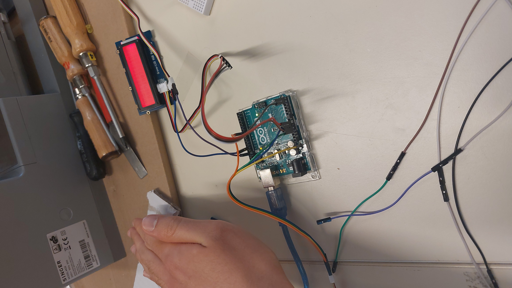
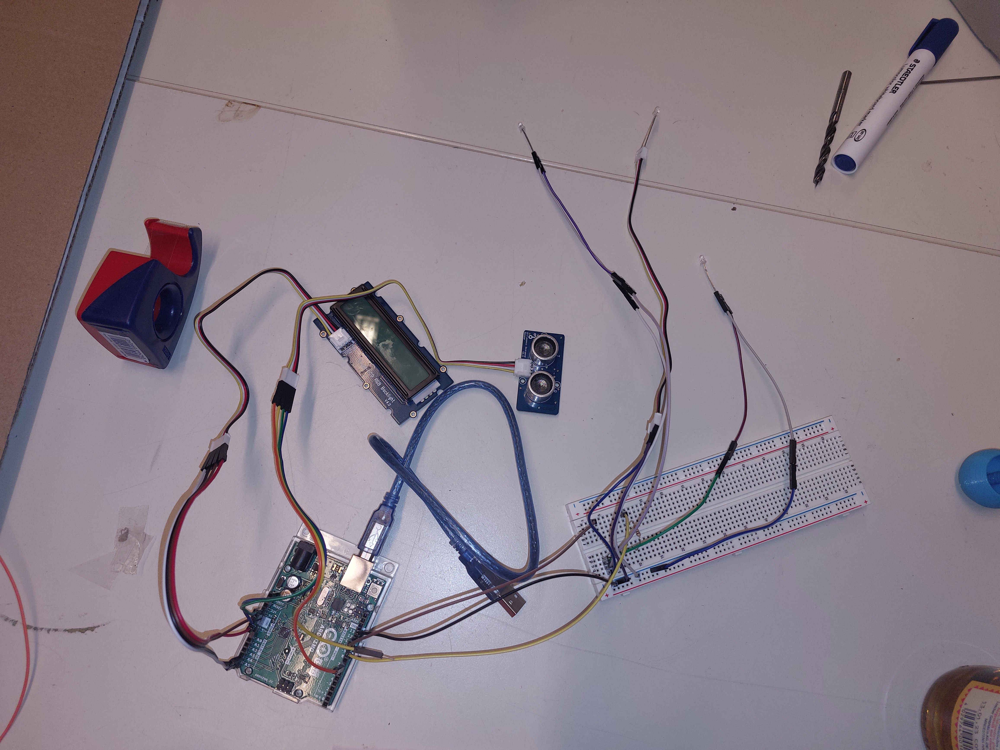
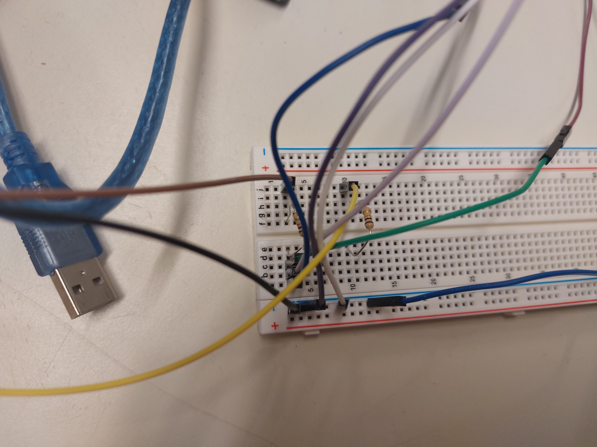
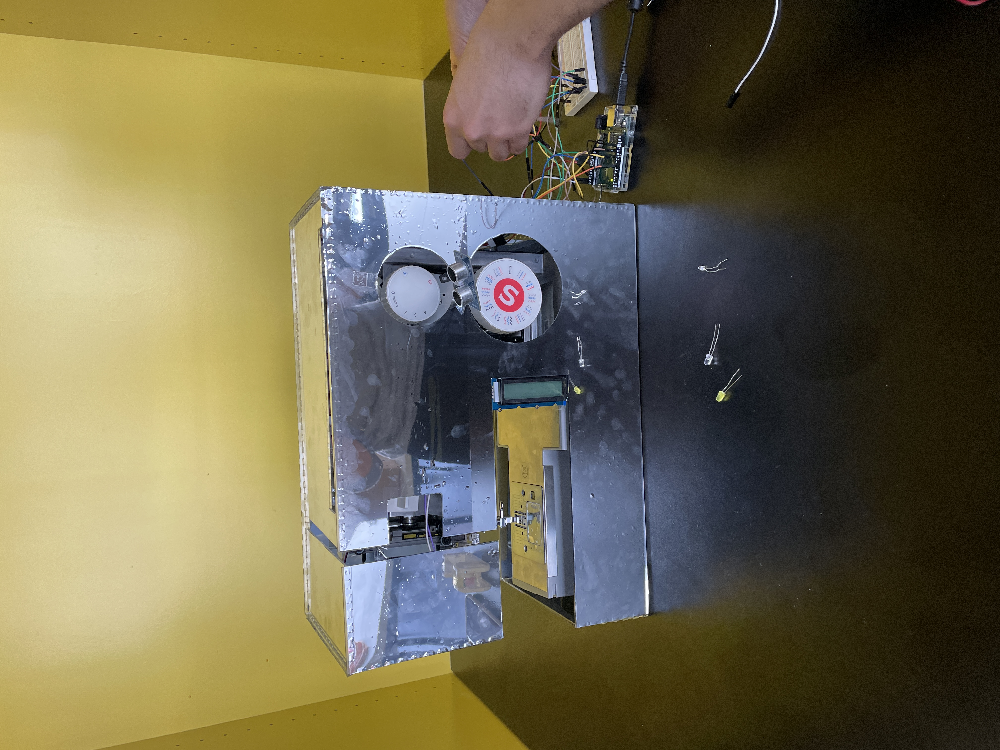

# Hardware Overview
| Name                                                                                                            | Quantität |
|---------------------------------------------------------------------------------------------------------------------------|--------------------|
| Arduino Uno Rev3 SMD                                                                                                      | 1                  |
| mit USB Stromkabel                                                                                                        |                    |
| [Grove - LCD RGB Backlight]([https://link-url-here.org](https://wiki.seeedstudio.com/Grove-LCD_RGB_Backlight/)           | 1                  |
| [Ultrasonic Sensor](https://create.arduino.cc/projecthub/rztronics/ultrasonic-range-detector-using-arduino-and-sr-04f-8a804d?ref=search | ref_id=ultrasonic  | offset=2) | 1 |
| Steckplatine (830 Steckplätze)                                                                                            | 1                  |
| [LED Lämpchen](https://create.arduino.cc/projecthub/karmette/basic-led-setup-for-beginners-0a124a)                 | 4                  |
| 4er-Stecker (female-to-female)                                                                                            | 2                  |
| Stecker (female-to-male)                                                                                                  | 16                 |
| Stecker (male-to-male)                                                                                                    | 8                  |
| Metallschichtwiderstand                                                                                                   | 2                  |
| 10.0K Ohm 0.25 Watt PTH                                                                                                   |                    |

# Hardware Installation (Additional pictures)

   

Overview of Arduino installation  

   
In detail on arduiono (left) and breadboard (right)  

  
Installtion process on our Artefact
